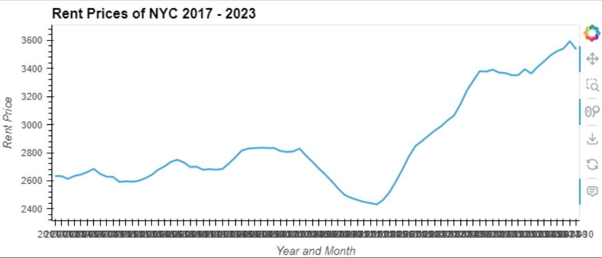

# U.S. Major City Housing/Rent/Crime Analysis

## New York City Analysis
### 

## NYC Plots

## Chicago Analysis
### The Chicago Housing/Rental Analysis we want to check to see if the pandemic had any influence on the housing and rental market in the city of Chicago.  The average housing price to purchase Pre-Pandemic between the years of 2017-2020 is $251,098.31.  Between those years the pricing of the houses was already going up in price yearly as there was a $40,000 price increase before the pandemic.  Post-Pandemic the average cost of the house is at $280,382.31 in the years between 2020-2023.  In those years the housing market is still moving upwards where between 2020 to 20023 there has been a $10,000 price up tick. The same can be said for the rental market as well as the pandemic did not stop the price up tick as well in which the the minimum rent before the pandemic was $1,683.28 and the maximum after the pandemic the max average price is 1,837.40, which is a $200 increase.  In regards to the analysis the pandemic did not have any bearing on the pricing in Chicago.  Even though there were rent freezes and stimulus checks during the pandemic, it did not stop the rise the cost in the housing or rental markets.

## CHI Plots

## Los Angeles Analysis
### The average housing price in L.A. pre pandemic was $662,112 while post pandemic was $846,408 for the years we chose. As for the rent it was $2397 pre pandemic, and $2731 for the post pandemic.  The minimum price over the years that someone would have to pay, however, was $537,563 while the max was $775569 when buying a house before the pandemic. After the pandemic you could expect prices from $784473 up to the max which is $923738. On the rental side, however, it was $2424 to $2513 before the pandemic and $2524 to $2911 after the pandemic.

## LA Plots

